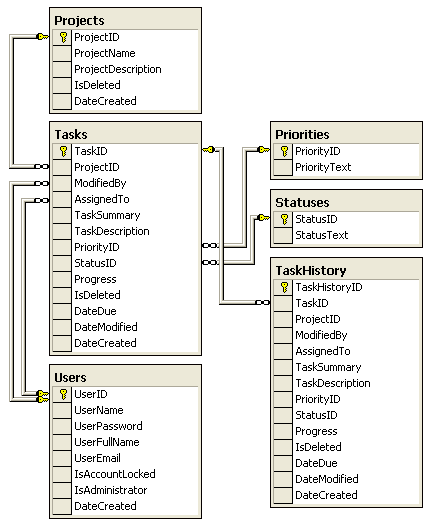
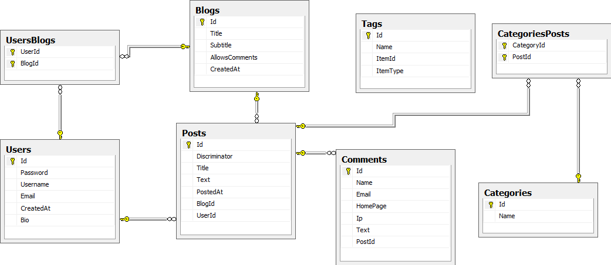
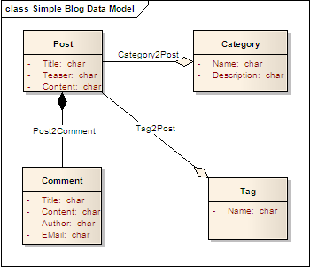
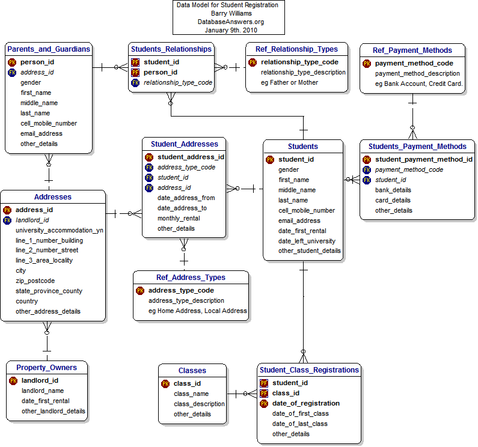

#Database Design

####Key learning points: 

#####1. Intro to MVC 
	* An app is just a databse in disguise (for the most part)
	* Views and Controllers
	* Models - think about classes for making new objects

#####2. Understanding tables
	* Rows and Columns
		* Rows are like our objects
		* The top row is like our model 
		* Columns are our attributes 
		
#####3. Relationships
	* Primary Key 
	* Foreign Key 
	* has_many 
	* belongs_to
	 

#####4. Data models
	* on paper / white board
	* tables
	* relationships - crows foot versus arrows
	* google image search for data models

	 	
> We are talking about the design of a database in the context of a relational database (EG SQL), that has **TABLES**

  
>**Task** Who has previously worked with DBs. What do you know? 
>Who has worked with Excel? Access? SQL? NoSQL? Graph dbs? 

---

1. Intro to MVC 
	* **Task** - take 2 minutes to research MVC and let's have a class discussion. 
	* An app is just a databse in disguise (for the most part). Perhaps "dressed up" is a better way to think about it, than "in disguise". Graphic User Interface or GUIs are just a layer that is created to make a database more intuitive and easier to interact with. The MVC pattern has been around since the dawn of GUIs, as a system to help us organize our code into three main parts. 
		1. Models - (the database), 
		2. Views - so that users can interact, and 
		3. Controllers (our go between for the views and the database)  		
	* Views - "The fancy outfit"
	* Controller - "The Valet, Butler or PA" 
	* Models - "the database" (think about classes for building new objects in Ruby)

2. Understanding **tables**

	A table is a collection of related data held in a structured format within a database. It consists of fields (columns), and rows.
	* Rows and Columns
		* Rows are like our objects - In the context of a relational database, a row—also called a **record** —represents a single, implicitly structured data item in a table. In simple terms, a database table can be thought of as consisting of rows and columns or fields.[1] Each row in a table represents a set of related data, and every row in the table has the same structure.
		* The top row (all the column headers) is like our model
		* Columns are our attributes - In the context of a relational database table, a column is a set of data values of a particular simple type, one for each row of the table.[1] The columns provide the structure according to which the rows are composed.
		
	* **Task** Make a list of differences between databases and spreadsheets, by your current understanding - "Unlike a spreadsheet, the datatype of field is ordinarily defined by the schema describing the table. Some SQL systems, such as SQLite, are less strict about field datatype definitions"
		
3. Relationships
	* **Task** take 3-5 minutes to research each of the following and let us discuss:
		* **Primary Key** 
			1. is a set of one (or more) attributes, the value(s) of which are guaranteed to be unique for each row (record) in a table.
			2. The value or combination of values of key attributes for any record cannot be duplicated for any other record in that table. 	
			3. You can assume that everyrecord in a table will have a primary key. the DB usually handles this for you. 
		 
		* **Foreign Keys** 
			1. A unique key (primary) that has migrated to another entity.
			2. This is used to draw relationships
		* **Task** 5 minutes. Based on what you know about keys - research and explain how we will be using keys to connect the following relationships inside our tables:
		* has_many - No need for keys 
		* belongs_to - Foreign Key 
		* has_and_belongs_to_many - has_many_through (the two active record many to manys)
	 

4. Data models // data modelling
	* **Task** Take 2 minutes to research what a data model is and how you might go about making one of your own. 
	* on paper / white board
	* tables
	* relationships - crows foot versus arrows
	* google image search for data models
	* **Task** Howmework for friday - Make a datamodel for your project2 idea to go along with your User Stories, Wireframe and Pitch. 

	
###Example data models found on google images:
---
### Task manager app : 

	
	
---

###Blog app:

---

### Blog app alternate:

---

###Student registration app:

####Optional add on if there is time at the end. 

5. Turning our data model into a schema
	* Filemaker pro
	* PGadmin and other GUI tools for making a DB Schema and Queries
	* Why we prefer to do this all by hand 	
	

