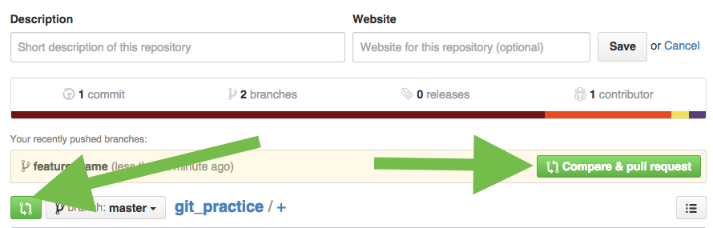

#Git your (cheat) sheets together

#####Resources

* [http://git-scm.com/documentation](http://git-scm.com/documentation)
* [slides](https://docs.google.com/presentation/d/1tE0D8F-TNNG36tjCN-H1hzhjAb2rWknGcohEESaPW08/edit?usp=sharing)


#####SWBAT

1. Git branch, checkout and merge (review)
2. Submit a pull request
3. Discuss merge conflicts
4. Make a markdown for a cheatsheet and submit a pull request to the class repo so that it gets posted.


## 1

Create a new rails project (skip unit testing and use a postgres db). Initiate Git. Make a remote repository. 

Look in the cheatsheets folder in the class repo if you need help. There is a markdown with some git cheats (from last time)

Answer:

```
$ rails new git_practice -T --database=postgresql

$ cd git_practice

$ git init

$ git add -A

$ git commit -m "initial"

(now go to github and create a new repo, copy ssh key)

$ git remote add origin (paste SSH)

$ git push -u origin master
 
```

Recap **remote v local**

## 2 

Create a new branch, make some changes on that branch, merge those changes to master

(just add a comment to your code for the changes)

Answer:

```
$ git checkout -b feature_name 

//we always try to name our branches after the feature that we are trying to build. remember! branches are totally disposable 

(or $ git branch feature_name 
& 
$ git checkout feature_name)

(make changes)

$ git checkout master

$ git merge feature_name

```

## 3 

Push changes to github

Answer:

```
$ git add -A

$ git commit -m "adds comments"

$ git push origin master

```

## 4 


Add another comment to the code on your feature branch.
Stage + commit it. DONT MERGE (just yet)


**Reminder!** If you checkout to a branch without commiting first, changes are seen by git as **GLOBAL** (and therefore will appear in the branch you just checked out WITHOUT you having merged them! **DANGER**)   

Moral of the story, before checking out, always commit


Back in terminal, lets try a new cool trick: 

```
$ git diff master

```

What does this do? Notice RED v GREEN

## 5

####Submitting a pull request. 

We have staged changes to feature_name branch that are not yet reflected on master.

We know how to merge these locally, but lets learn a cool new trick => Pull requests

(Note using a branch is not the only way to submit a pull request, you can also do this using a fork)

To create a pull request (which we shall do through github's GUI), we first need to make that branch appear on github. 

> Who's seen this before and can tell me how its done? 

``` 
$ git push origin feature_name

```

## 6

On github, click the "Compare & pull request" green button, take a look around, scroll all the way down and read the summary of insertion and deletions. Notice they are the same as ``` $ git diff ``` Then, complete your pull request to merge your code.

This will result in a new commit, with a message of its own.

Don't forget that you will now need to pull your **remote** master to update your **local** master as it now contains changes that you do not have locally! 

 
---





#THE BIG GREEN BUTTON: Submit a PR to yourself. 

##Pull Requests:

> A pull request is a method of submitting contributions to an open development project. It is often the preferred way of submitting contributions to a project using a distributed version control system (DVCS) such as Git.

The term "pull request" is slightly counter intuitive, it might seem like you are requesting to **pull someone's code**, from their remote repository (you have already have it by doing a git clone or a fork).

It is the process by which you present your code, for a repository admin to pull it in to their codebase. 

What is the difference between forking and cloning?

A - Forks are disconnected from "upstream". But you can still use a fork to submit a pull request.


##So WHY do we do this???


When multiple people are all working on the same codebase, at the same time, the **probability that they will try to make edits to the same line of code increases over time** 

**Google docs demo** (fire up a blank google doc, share the link and get everyone to type at the same time) 


---

#Merge conflicts

> Merge conflicts are not bad! They are just a fact of life. 

* They happen when git (or other version tracking software) cannot understand a series of conflicting insertions and deletions in two seperate branches, between commits, at time of merge.  

* They can occur if two people have touched the same line (/lines) of code between commits/merges. They can also occur if you are working solo, on multiple branches. 

* The longer in between commits/merges, the more likely they will occur. 

* Our goal is not to avoid creating merge conflicts, it is simply to **adopt a best practice workflow**, so that we can keep a better record of our merges. 

* By default if you commit and merge often, you will greatly reduce the **probability of creating a merge conflict** 

* Remember! Git tracks INSERTIONS (in green) and DELETIONS (in red) These are nicely reflected in you GUI in github.

* We will look at resolving merge conflicts at another time. The best way to learn this is through **practice** 


##Best practices:

* Commit often
* USE PRs!!!!! (avoid merging locally for team workflow)
* Merge often
* Use strong commit messages (bonus if in present tense)
* Use branches
* and...


Remember! Branches are totally disposable 

If you want to discard it, simply commit the changes on it, and delete it. Not to be confused with ```$ git stash```


## Last task:
In the remaining time:
cd cd 
1. Pair up
2. Make a cheatsheet in markdown format 
3. Submit a pull request to the class repo 

There are currently two cheatsheets already in the class repo; "how to make a markdown" and "git cheats". There is everything that you need to get started. 
 
Before you start please write on the board what you are making so that we dont have duplicates. Do something that you feel passionate about.


Ideas: 

* Command Line tools
* CSS (positioning, animations etc...)
* JS (arrays, loops, etc)
* Angular
* Firebase / Heroku
* Database design
* Ruby Basics
* Rails stuff


