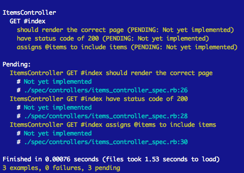

 #Controller Specs
in Rails using Rspec

> The goal for today is to learn how to test our controller actions


## Setup

```git clone https://github.com/blaisethomas/controller_specs``` for starter code 

```bundle install```

```rake db:migrate```


This is just a basic scaffold for a single model app. If the clone link above is no longer available, you can:

```
cd scratch/
rails new Shoppinglist -T
cd Shoppinglist/
subl .
gem install rspec
bundle
rails g rspec:install
rails g scaffold Item name qty:integer checked:boolean #just this once!!
rake db:migrate
```


Here we have a basic shopping list app with a single model "Item". We are going to look at testing our basic CRUD controller actions. 


##1 .rspec terminal output configuration 

```
--color
--warnings
--require spec_helper

to 

--color
--format=documentation
--require spec_helper
```


##2 - Let's write some examples 
```
describe "GET #index" do
  it "should render the correct page" 
  it "have status code of 200" 
  it "assigns @items to include items" 
end
```

Then in terminal
```
$ bundle exec rspec spec/controllers
```

####Notice pending - Yellow!





##3 - LAB : Write some tests

This is a selected shortlist of built-in 'expect' matchers in rspec to get us started. See [relishapp documentation](http://www.relishapp.com/rspec/rspec-expectations/docs/built-in-matchers) or [rubydocs documentation](http://www.rubydoc.info/gems/rspec-expectations/frames) for a more complete list


```

Object identity
expect(actual).to be(expected) # passes if actual.equal?(expected)

Object equivalence
expect(actual).to eq(expected) # passes if actual == expected

Comparisons
expect(actual).to be >  expected
expect(actual).to be >= expected


Types/classes/response
expect(actual).to be_instance_of(expected)
expect(actual).to be_kind_of(expected)
expect(actual).to respond_to(expected)

Truthiness and existentialism
expect(actual).to be_truthy    # passes if actual is truthy (not nil or false)
expect(actual).to be true      # passes if actual == true
expect(actual).to be_nil       # passes if actual is nil
expect(actual).to exist        # passes if actual.exist? and/or actual.exists? 

Collection membership #like yesterday's quiz (include?)
expect(actual).to include(expected)
expect(array).to match_array(expected_array)# ...which is the same as:

Change observation
expect { object.action }.to change(object, :value).from(old).to(new)
expect { object.action }.to change(object, :value).by(delta)

```

##4 - Write a test for each example (watch it FAIL in RED) 


##5 - Then make it pass by writing the code (GREEN)
This is the bit we already know how to do!


