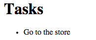
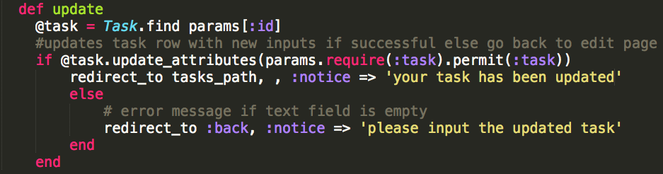
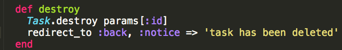
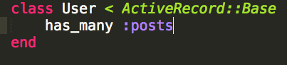

controller methods/actions:

  def  index

  def create

  def edit

  def new (new class means a new page)

  def destroy

 

to see possible routes in terminal:

rake routes

 

<b>task_path(task) same as task</b>

 

to see specific route:

rake routes |grep action

 

 

------------------------------------------------------------------------------

 

 

 
1) rails new tasks (NAME OF APP) = make new app
 

2) ADD PATH TO ROUTES go to config/routes.rb 

 

4) rails g controller tasks index = always use plural name. index creates views/index.html.erb

 

5)* ADD ROOT TO ROUTES goto config/routes.rb (replaces local host 3000 with index)

 

6) rails g model Task task:string = creates a table Task and attribute task with string attributes in db/migrate. can add on as              many attributes. always do this before db:migrate

 

7) rake db:migrate = migrates the Task database from db/migrate to backend (SQL database)

 

8)*&nbsp;check to see if database Task is in the backend of rails&nbsp;

       rails c = rails console

       Task.connection

       Task

      make new task with string

       Task.all 

       Task.create(task: “go to store”)

      to see new added task

        Task.all OR

        Task.find(1) = find the task with id of 1

      cntrl d to exit out of rails console

 

9) CREATE TABLE INSTANCE VARIABLE goto controllers/tasks_controller.rb add         

 

10) CREATE TASK IN VIEW goto views/index.html.erb add

      

    

    

11)  ADD TEXT INPUT TO VIEW goto index.html.erb add    

    

    

12) ADD A CREATE ACTION IN CONTROLLER goto controller.rb add    

 

 

 

13) ADD EDIT LINK TO VIEWgoto index.html.erb add

  

 

15) MAKE A PARTIAL IN VIEW create _form.html.erb to put in partial form   

 

  

 

15) MAKE EDIT IN VIEW edit.html.erb in views/tasks

 

 

17) ADD AN EDIT AND UPDATE ACTIONS IN CONTROLLERgoto tasks_controller.erb add @task, edit, update

 

 

 

 

18) ADD VALIDATION IN MODEL goto models/task.rb add 

      

 

19) ADD ERROR AND SUCCESS UPDATE MESSAGES IN UPDATE goto tasks_controller.rb add :notice

 

 

20) ADD A MESSAGE IN VIEW goto views/layouts/application.html.erb add

 

 

21) ADD DELETE LINK TO VIEW goto view/index.html.erb add li id, link_to ‘Delete’

 

 

22) ADD DELETE ACTION IN CONTROLLER  goto tasks_controller.rb add

 

 

-----------------------------------------------------------------------

RAILS CMNDS

rake db:seed = load seed.rb

model name:references = add this to the end of rails g model for foreign key. hook up other data models

 

reload!= reloads rails c

 

----------------------------------------------------------------------------------------------------

ERB SNIPPET PACKAGE SHORTKEYS SUBLIME

 

 

 

----------------------------

USER MODEL STEPS

 

1)add migration

 

 

 

2) RAKE DB:MIGRATE

 

 

3) add has many and belongs to the models

 

 

 

add profile to user

 

add user to profiles belongs to user

 

 

 

 

 

 

 

 

 

 

 

 

 

 

 

 

 

 

 

 

      
 

